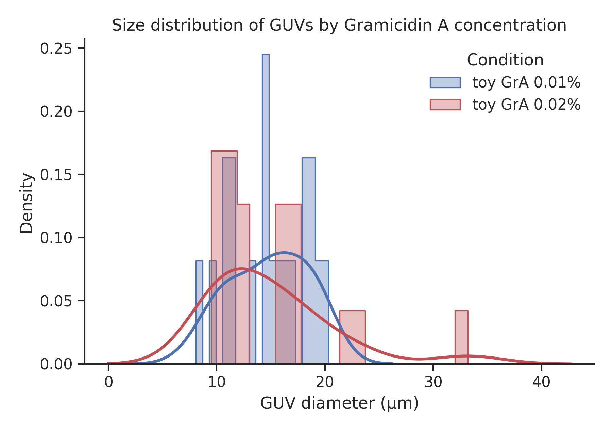
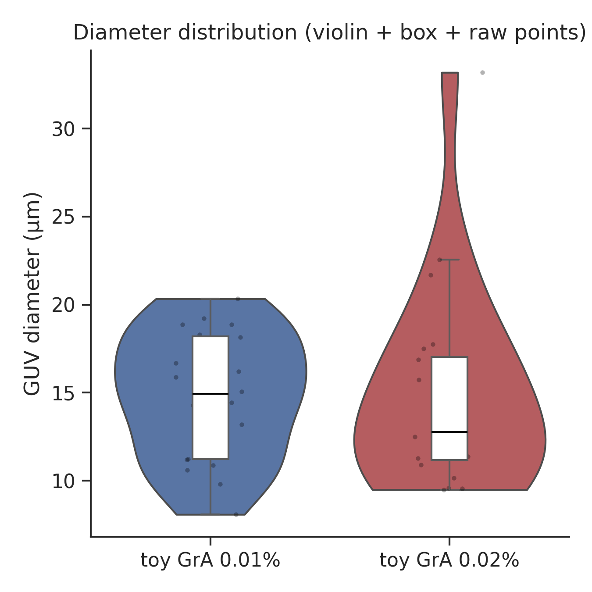
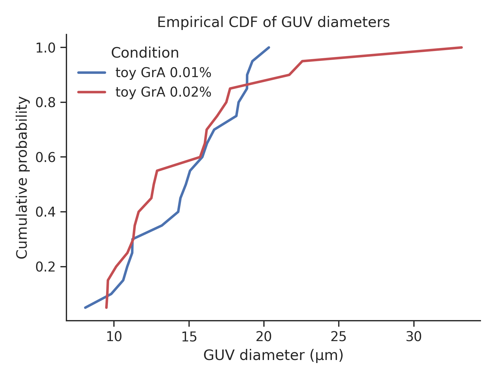
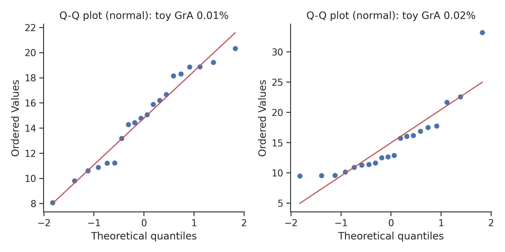

# GUV-GrA Size Analysis

Statistical analysis of giant unilamellar vesicle (GUV) size distributions at two concentrations of Gramicidin A (0.01% and 0.02% w/w) in DOPC:DOPG membranes. This analysis complements my simulation work in [membrane-biophysics-models](https://github.com/TamannaMS/membrane-biophysics-models) and my experimental work on giant unilamellar vesicles (GUVs) at the Biophysics Laboratory, BUET, where I study how Gramicidin A ion channels drive membrane remodeling and poration.

## ⚠️ Data notice

**The original research data is not included in this repository.** Only a small synthetic **toy dataset** (`data/toy_dataset/toy_guv_sizes.xlsx`) is tracked by git, so that anyone can clone this repo and run the notebook end-to-end without access to my real measurements. All figures and numbers currently in this repo (`figures/`) were generated from that toy dataset — they are placeholders demonstrating the pipeline, not real results.

To run the analysis on your own data, place your workbook at `data/size_distribution_of_guvs.xlsx` (git-ignored, so it won't be committed) and set `USE_TOY_DATA = False` in the second cell of the notebook.

## Repository Contents

| Component | Analysis | Key methods | Output |
|--------|---------|---------------|--------|
| `01_exploratory_analysis.ipynb` | Descriptive statistics of GUV diameters per condition | mean, median, CV, skew, kurtosis | `summary_statistics.csv` |
| `01_exploratory_analysis.ipynb` | Distribution shape: normal vs. log-normal | Shapiro-Wilk test, raw vs. log-transformed | printed test statistics |
| `01_exploratory_analysis.ipynb` | Between-condition comparison | Mann-Whitney U, Welch's t-test, Cohen's d, KS test | printed test statistics |
| `01_exploratory_analysis.ipynb` | Publication-style figures | histogram+KDE, violin/box/strip, ECDF, Q-Q plots | 4 figures (PNG + SVG) |
| `src/load_data.py` | Shared data-loading helper | tidy long-format dataframe from multi-sheet `.xlsx` | — |
| `scripts/generate_toy_data.py` | Synthetic dataset generator | log-normal sampling (seeded) | `toy_guv_sizes.xlsx` |

---

## 1. Data Loading

`src/load_data.py`

Loads GUV diameters from a multi-sheet Excel workbook into a tidy long-format dataframe — one row per vesicle, with derived spherical area and volume columns.

**Format:** one sheet per condition, one column of diameters (µm) per sheet.

**Derived quantities** (assume a perfect sphere — convenience values, not shape evidence):
radius = diameter / 2 area = π · radius² volume = (4/3) · π · radius³                    
## 2. Descriptive Statistics

Per condition: n, mean, median, standard deviation, coefficient of variation, min/max, quartiles, skew, and excess kurtosis.

## 3. Distribution Shape: Normal vs. Log-Normal

GUV sizes from electroformation are commonly closer to log-normal than normal, so I test both before choosing a parametric or non-parametric comparison:
Shapiro-Wilk W statistic on raw diameters Shapiro-Wilk W statistic on log(diameters)     
## 4. Between-Condition Comparison

**Non-parametric (primary):** Mann-Whitney U — no distribution assumption, robust to the skew in the 0.02% condition.

**Parametric reference:** Welch's t-test (does not assume equal variance).

**Effect size:** Cohen's d,
d = (x̄₁ - x̄₂) / s_pooled

**Distribution-level check:** two-sample Kolmogorov–Smirnov test on the cumulative distributions.

## 5. Figures

Four publication-style figures per run (PNG at 300 dpi + SVG):

**Size distribution by Gramicidin A concentration (histogram + KDE)**



**Diameter distribution (violin + box + raw points)**



**Empirical CDF of GUV diameters**



**Q-Q plots (normal) per condition**



*All figures above were generated from the synthetic toy dataset — see the data notice.*

## Quickstart

```bash
git clone https://github.com/TamannaMS/guv-gra-size-analysis.git
cd guv-gra-size-analysis
pip install -r requirements.txt
jupyter notebook notebooks/01_exploratory_analysis.ipynb
I've set the notebook to run on the toy data by default (USE_TOY_DATA = True), so it works out of the box. To regenerate the toy dataset:python scripts/generate_toy_data.py
Dependencies
Python 3.9+
pandas, NumPy, SciPy, Matplotlib, Seaborn, openpyxl
pip install -r requirements.txt
Planned extensions (blocked on raw images)
02_image_segmentation.ipynb, 03_shape_analysis.ipynb, and 04_correlation_with_manual_counts.ipynb would add vesicle segmentation, circularity/shape descriptors, and validation against manually counted diameters — all require the original micrographs, which are outside the scope of this repo.

Author
Tamanna Mostafa Snigdha M.S. Student (Biophysics), Department of Physics Bangladesh University of Engineering and Technology (BUET)

GitHub: TamannaMS

License
MIT — see LICENSE.

